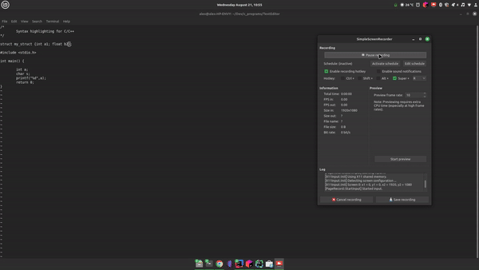
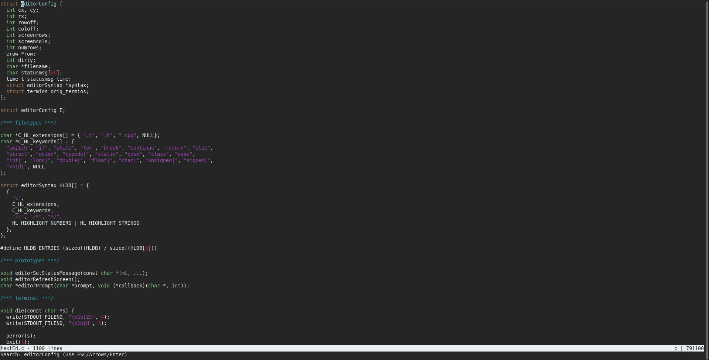

# Text Editor

This project is a simple text editor implemented in C. It provides basic functionalities such as syntax highlighting, file saving, and keyboard navigation.

## Features

- Basic text editing
- Syntax highlighting for C/C++ code
- File saving and opening
- Search functionality
- Basic keyboard shortcuts for navigation

## Demo

<!-- Insert a picture or video showcasing the editor in action -->



## Installation

To compile and run the text editor, follow these steps:

1. Download the repo
2. Run
```bash
   make textEd
   ./textEd <file>
```

## Contributing
Contributions are welcome! Please fork the repository and create a pull request with your changes.

## Acknowledgements
This editor is inspired by kilo by Salvatore Sanfilippo.
